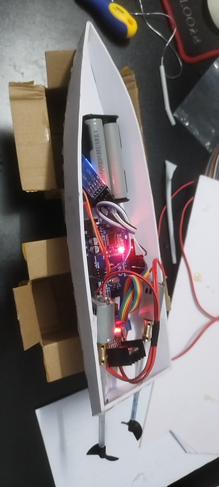
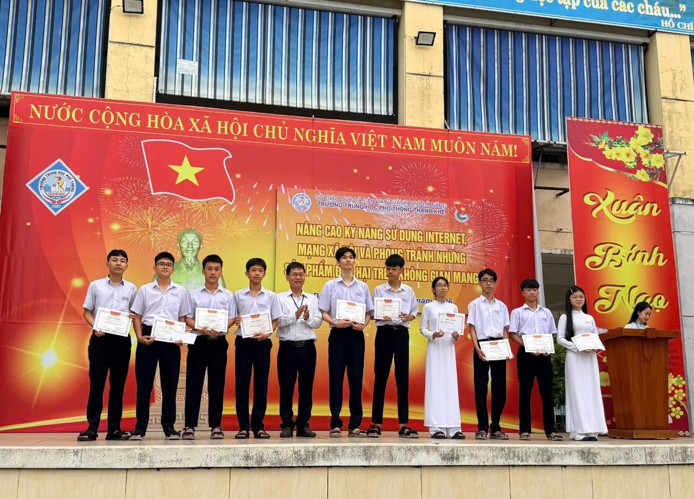
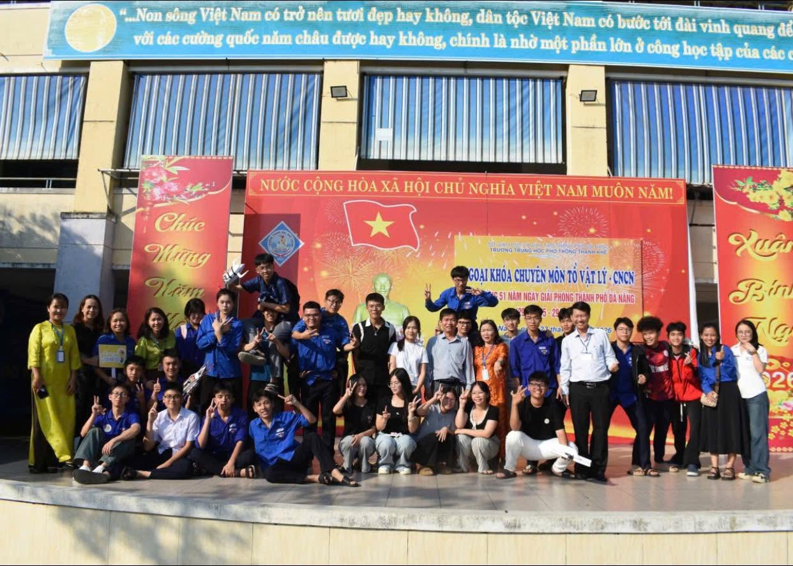
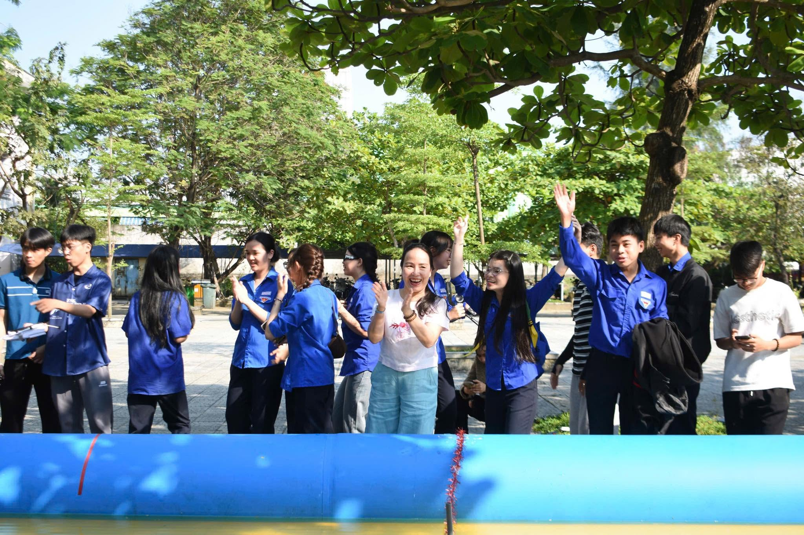
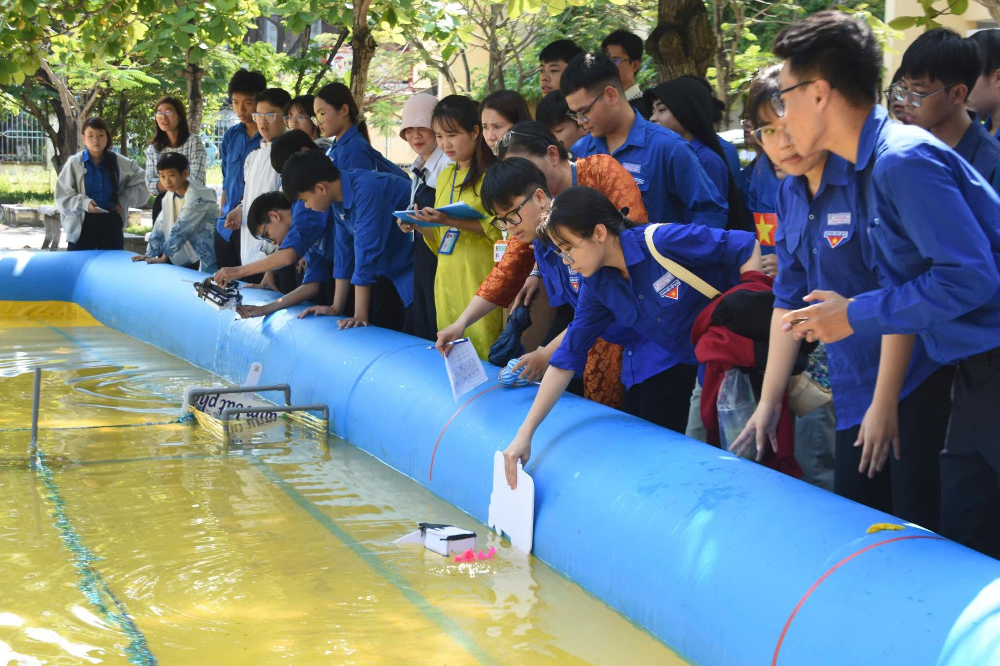
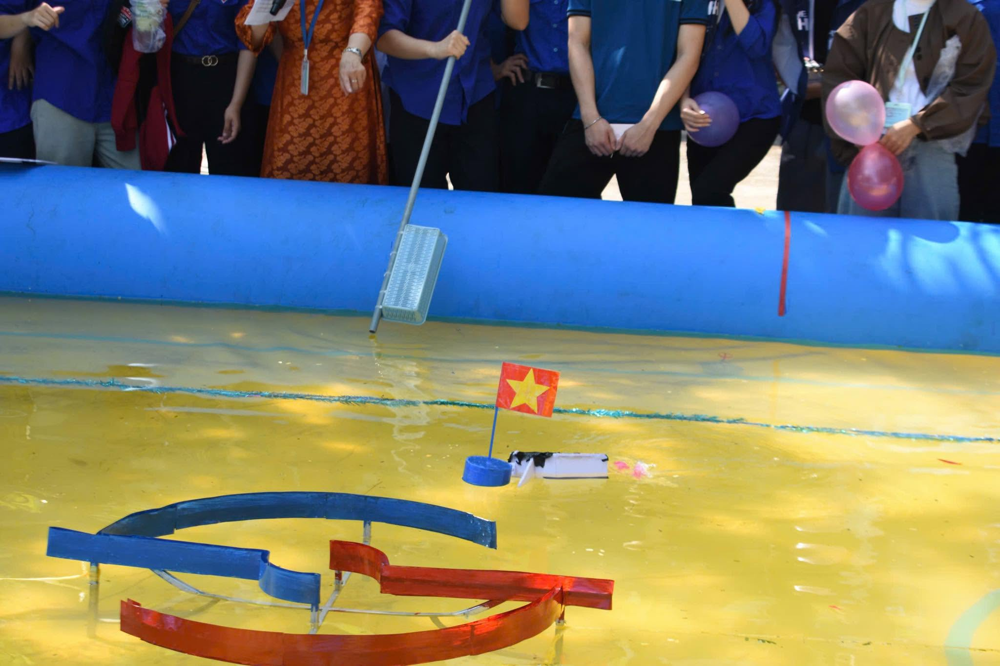
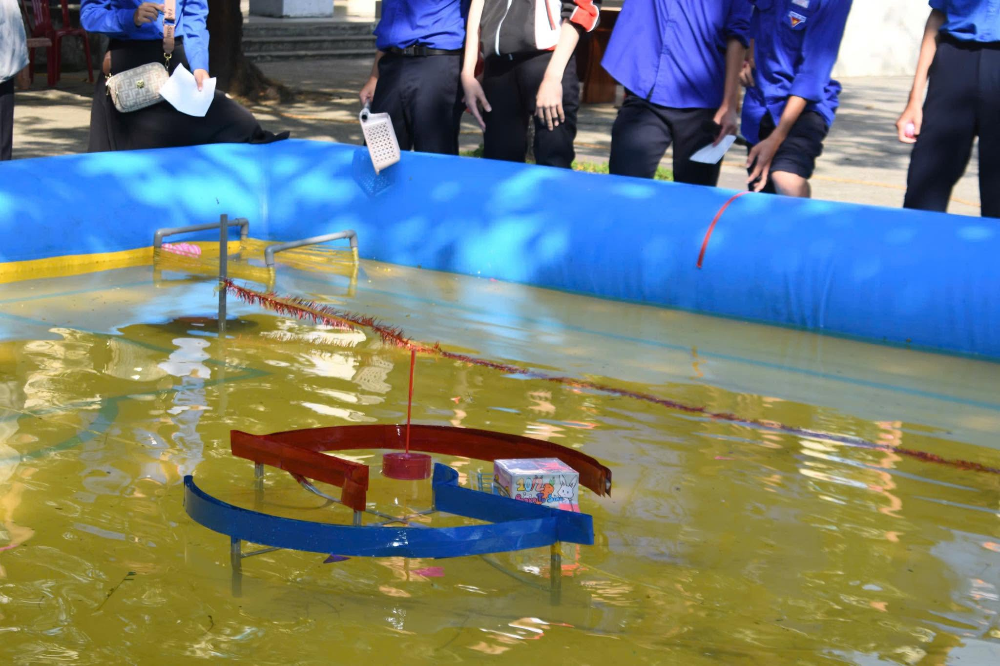

# 🛥️ Arduino Smart Boat

> Developed during Grade 12 — independently engineering a complete technical solution for a school-level STEM boat design competition.

<p align="center">
  
</p>

## 📖 About

Arduino Smart Boat was developed during my Grade 12 year, when I independently engineered the complete technical solution to support a school-level STEM boat design competition.

Rather than creating a single working prototype, the project evolved into a complete technical solution that enabled student teams to build, program, and operate their own boats. It included the boat design, Arduino firmware, wiring diagrams, a bill of materials, and technical documentation. I also directly guided and supported the teams throughout assembly, programming, and testing, enabling them to successfully build and operate their boats.

This repository preserves the project in its original state, including the original source code, technical documentation, design files, and student materials exactly as they were used throughout the competition.

## ✨ Features

### 🚤 Engineering Features

- 📱 Mobile application for wireless boat control.
- ⚙️ Dual-motor differential steering system for propulsion and maneuvering.
- 📐 Replicable hardware design with detailed wiring diagrams and a complete bill of materials.

### 📚 Project Resources

- 💻 Original Arduino firmware used throughout the competition.
- 📚 Comprehensive technical documentation and student learning materials.
- 👨‍🏫 Practical guides supporting student teams during assembly, programming, and testing.

## 📸 Project Gallery

### Prototype

<p align="center">
  
</p>

<p align="center">
  
</p>

### Competition

<p align="center">
  
  
  
</p>

<p align="center">
  
  
  
</p>

<p align="center">
  
</p>

*Developed as part of the technical solution for a school-level STEM boat design competition.*

## 🔧 Hardware Overview

- **Arduino Uno R3** — Main controller.
- **HC-05 Bluetooth Module** — Wireless communication.
- **L298N Motor Driver** — Controls the dual DC motors.
- **2 × DC Motors** — Differential propulsion and steering.
- **Li-ion Battery Pack** — Power supply.

## 📂 Repository Structure

```text
Arduino-Smart-Boat/
├── docs/
│   ├── Bill_of_Materials.pdf
│   ├── Boat_Frame_Design.pdf
│   ├── Boat_Template.pdf
│   ├── Competition_Rules.pdf
│   └── Wiring_Diagram.pdf
│
├── firmware/
│   └── SmartBoat.ino
│
├── media/
│   ├── hardware.jpg
│   ├── demo.gif
│   ├── demo.mp4
│   └── students_competition/
│       ├── students_competition_1.jpg
│       ├── ...
│       └── students_competition_7.jpg
│
├── student-materials/
│   └── Student_Guide_Original.pdf
│
├── .gitignore
├── LICENSE
└── README.md
```

## 📄 Documentation

The following documents are included to help reproduce, understand, and use the project.

| Document | Description |
|----------|-------------|
| 📦 [Bill of Materials](docs/Bill_of_Materials.pdf) | Lists all required components. |
| 🛠 [Boat Frame Design](docs/Boat_Frame_Design.pdf) | Defines the boat structure and dimensions. |
| 📐 [Wiring Diagram](docs/Wiring_Diagram.pdf) | Shows the hardware connections. |
| 📄 [Boat Template](docs/Boat_Template.pdf) | Provides a printable construction template. |
| 📋 [Competition Rules](docs/Competition_Rules.pdf) | Describes the official competition rules. |
| 🎓 [Student Guide](student-materials/Student_Guide_Original.pdf) | Guides student teams through assembly, programming, and testing. |

## 📄 License

This project is licensed under the MIT License.

See the [LICENSE](LICENSE) file for more details.

## 🙏 Acknowledgements

My sincere thanks to the teachers who organized the STEM boat design competition and to all participating student teams.

Working alongside the students throughout the competition was one of the most rewarding parts of this project. Their enthusiasm gave this technical solution a purpose beyond engineering.